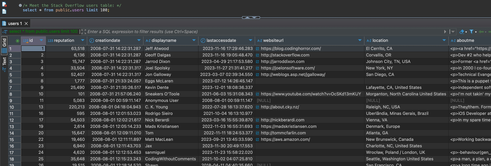

# Fundamentals of Select

**Brent Ozar - SmartPostgres.com**

---
# Who This Session is For

- You're a developer who stores data in Postgres.
- You're comfortable writing queries, perhaps even making indexes.
- You're uncomfortable reading explain plans.
- You haven't been to a formal Postgres class since college (if at all.)
- You've never read the Postgres source code (and don't want to.)
---
# What You'll Learn

- How select queries use tables & indexes
- How to quickly read the basics of an explain plan
- The first places to look in an explain plan
- How to use check_indexes
- How column order matters in an index

---
# The Stack Overflow Database

- Data export from https://StackOverflow.com as of 2024-04
- Original source: https://archive.org/details/stackexchange
- Download: https://smartpostgres.com/go/getstack
- About 117GB data with fun-to-query tables:
  users (21M rows), posts (60M), votes (236M)

--- 
# Meet the Users Table.

---
# About This Session

- MIT License: feel free to adapt it, present it yourself
- Source: https://github.com/SmartPostgres/Box-of-Tricks

--- 
# Meet the Users Table.

